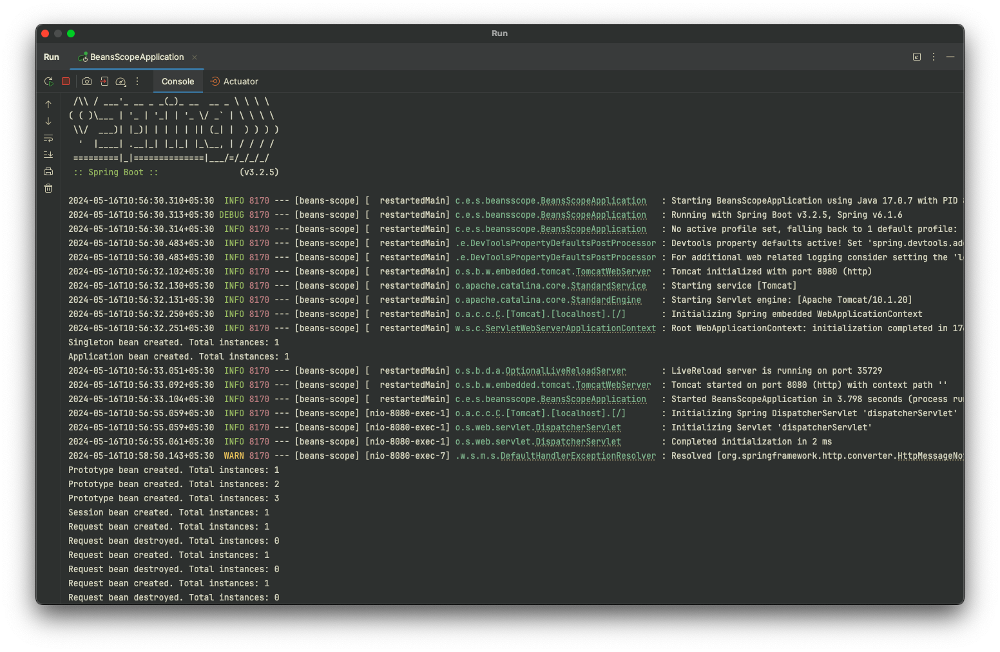

# beans-scope

**Project Description:**
This project demonstrates the use of different bean scopes in a Spring Boot application. It includes a RESTful API with endpoints to manage a shopping cart, showcasing the behavior of singleton, prototype, session, request, and application scoped beans. Through this project, we can understand how beans with different scopes behave in Spring applications, particularly in the context of managing shopping cart data across different sessions and requests.

## Bean's scope
scopes determines how Spring manages the lifecycle and accessibility of these beans within the application context.
- **Singleton Scope:** In Spring, a singleton bean is created only once per application context. This means that regardless of the number of requests or sessions, there's only one instance of the bean throughout the application's lifecycle.
- **Application Scope:** Application scope, also known as ServletContext scope, is similar to singleton scope in that it creates only one instance per application context. However, application scope is specific to web applications and is scoped to the lifecycle of the ServletContext. This means that the same instance is shared across all servlets and JSP pages in the web application.
- **Prototype Scope:** Prototype scope creates a new instance of the bean each time it's requested. This means that every time the bean is injected or retrieved from the application context, a new instance is created.
- **Request Scope:** Request scope, as the name suggests, creates a new instance of the bean for each HTTP request. This allows each request to have its own instance of the bean, which is particularly useful for request-specific data that should not be shared across different requests.

Prototype-scoped beans are not managed directly by the Spring container, the term "managed by the Spring container" refers to beans whose lifecycle, creation, configuration, and destruction are handled by the Spring IoC (Inversion of Control) container.

When a bean is managed by the Spring container, it means that the container is responsible for:

1. **Instantiation**: The container creates instances of beans based on their definitions in the application context.

2. **Configuration**: The container injects dependencies, sets properties, and performs any necessary configuration on the beans.

3. **Lifecycle Management**: The container manages the lifecycle of beans, including initialization callbacks (such as `@PostConstruct` methods) and destruction callbacks (such as `@PreDestroy` methods).

4. **Scoping**: The container manages the scope of beans, ensuring that beans are created and destroyed according to their scope (e.g., singleton, prototype, request, session, etc.).

When a bean is not managed by the Spring container, it means that the container does not control its lifecycle or instantiation. In the case of the `prototype` scope, Spring does not manage the instances directly; instead, it delegates the responsibility of instantiation to the client code, typically using a factory method or an `ObjectFactory`. This is why beans with prototype scope require special handling, such as using `ObjectFactory`, to obtain new instances.

## **Output:**
Added 3 products in cart to all scope using Postman.


[//]: # ()

### Printing the cart after adding

```json
GET: http://localhost:8080/cart/singleton
[
  {
    "name": "Product 1",
    "price": 100.0
  },
  {
    "name": "Product 2",
    "price": 100.0
  },
  {
    "name": "Product 3",
    "price": 100.0
  }
]

GET: http://localhost:8080/cart/prototype
[]

GET: http://localhost:8080/cart/application
[
  {
    "name": "Product 1",
    "price": 100.0
  },
  {
    "name": "Product 2",
    "price": 100.0
  },
  {
    "name": "Product 3",
    "price": 100.0
  }
]

GET: http://localhost:8080/cart/session
[
  {
    "name": "Product 1",
    "price": 100.0
  },
  {
    "name": "Product 2",
    "price": 100.0
  },
  {
    "name": "Product 3",
    "price": 100.0
  }
]

GET: http://localhost:8080/cart/request
[]
```

It looks like some unexpected behavior?
Let's break it down:

1. **Singleton Scope**: The singleton scope means that Spring creates only one instance of the bean for the entire application context. So, when you add products to the singleton cart, they persist because the same instance is being used across all requests.

2. **Prototype Scope**: Prototype scope means that a new instance of the bean is created every time it's requested. In your code, when you call `prototypeCartFactory.getObject()`, a new instance of `ShoppingCartPrototype` is created. So, every time you call `addToPrototypeCart`, you're adding products to a new instance, which is not the same as the one retrieved when you call `getPrototypeCart`. That's why you see an empty cart when you try to retrieve it.

3. **Session Scope**: The session scope is scoped to an HTTP session. So, as long as the session is active, the same instance of the bean will be used. This explains why you see the products added to the session cart persisting across requests within the same session.

4. **Request Scope**: Similar to prototype scope, a new instance of the bean is created for each HTTP request. So, when you add products to the request cart, it's added to a new instance of the bean, and that instance is discarded after the request is complete. Hence, you see an empty cart when you try to retrieve it.

5. **Application Scope**: This is similar to singleton scope but scoped to the lifecycle of a ServletContext. So, the same instance is used across the entire application.

Given these explanations, the behavior we are seeing with the prototype and request scopes is expected. If you want the products to persist across requests within the same session or the entire application, you might need to adjust your bean scopes accordingly.